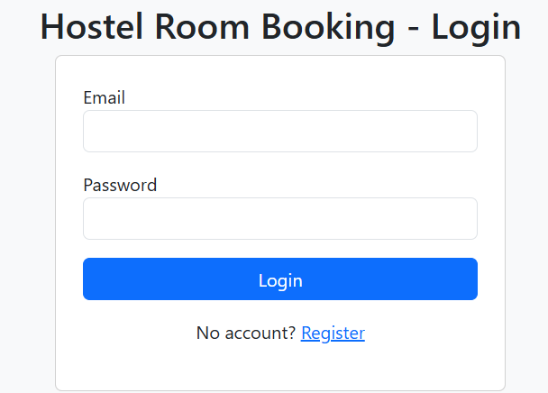

# 🏨 Hostel Room Booking System - Frontend

This is the **frontend** of the Hostel Room Booking System (Mini Project).  
It provides the user interface for **students** and **admin** to manage hostel room reservations.

---

## 📌 Features

### User Side
- **Registration** – Sign up to create an account.
- **Login** – Authenticate and access booking features.
- **Book a Room** – Select room type, dates, and confirm booking.
- **View Booking History** – Check all past reservations.

### Admin Side
- **View All Bookings** – See all users and their reservations.
- **Manage Room Availability** – Monitor which rooms are booked.

## 🛠️ Technologies Used
- HTML5
- CSS3
- JavaScript (Vanilla)
- We can also fetch API for backend communication

(Screenshot2.png)(Screenshot3.png)(Screenshot4.png)(Screenshot5.png)